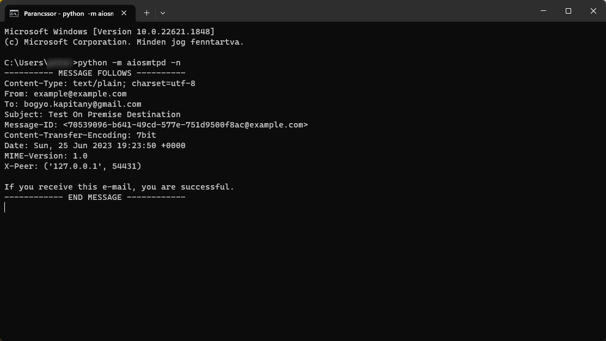

# MailOnPremise - Mail
> Business Application

Create a CAP application with [yo](https://yeoman.io/)  SAP HANA Academy [CAP generator](https://www.npmjs.com/package/generator-saphanaacademy-cap)

Install yo and the CAP template generator:
```
npm i -g yo
npm i -g generator-saphanaacademy-cap
```

Create a basic CAP project
```
yo saphanaacademy-cap
```

Extend the CAP service with SMTP support, follow blog
[Connecting On Premise Mail Destination and Sending Email Using SAP Cloud SDK JavaScript Version 3 on SAP CAP](https://blogs.sap.com/2023/02/14/connecting-on-premise-mail-destination-using-sap-cloud-sdk-javascript-version-3-on-sap-cap/)
```
npm install
npm install @sap-cloud-sdk/mail-client
npm install @sap-cloud-sdk/connectivity
npm install @sap/xssec​
npm install passport
```


Create xsuaa (application), destination (lite) and connectivity (lite) service instances.
```
cf create-service SERVICE PLAN SERVICE_INSTANCE [-b BROKER] [-c PARAMETERS_AS_JSON] [-t TAGS]
```

```
cf create-service xsuaa application MailOnPremise-xsuaa
cf create-service destination lite MailOnPremise-dest
cf create-service connectivity lite MailOnPremise-conn
```

Create service keys
```
cf create-service-key SERVICE_INSTANCE SERVICE_KEY [-c PARAMETERS_AS_JSON]
```

```
cf create-service-key MailOnPremise-xsuaa MailOnPremise-xsuaa-key
cf create-service-key MailOnPremise-dest MailOnPremise-dest-key
cf create-service-key MailOnPremise-conn MailOnPremise-conn-key
```

List service keys:
```
cf service-keys MailOnPremise-xsuaa
cf service-keys MailOnPremise-dest
cf service-keys MailOnPremise-conn
```
List services:
```
cf services
```

or
```
cf service MailOnPremise-xsuaa
cf service MailOnPremise-dest
cf service MailOnPremise-conn
```


In BTP Desintations create a new MAIL destination:
```
#mail.password=<< Existing password/certificate removed on export >>
#
#Sun Jun 25 20:21:58 UTC 2023
Type=MAIL
mail.description=Connect On-premise SMTP server from BTP
mail.user=298c4aacbc1c84
mail.smtp.from=from@example.com
Authentication=BasicAuthentication
mail.smtp.host=sandbox.smtp.mailtrap.io
Name=mail_destination
ProxyType=OnPremise
mail.smtp.port=2525
mail.smtp.auth=true
```

SCC access control list: 
``` 
back-end type: non-SAP system  
protocol: TCP  
virtual: sandbox.smtp.mailtrap.io:2525  
internal: localhost:8025  
```

In cmd start an SMTP server, default port is 8025:
```
python -m aiosmtpd -n
```

After deployment bind the application to the service instances. It can be done by mta.yaml.

From test.http call the service
```
POST https://530335dctrial-dev-mailonpremise-srv.cfapps.us10-001.hana.ondemand.com/mail/sendMail
Content-Type: application/json
```

Content in cmd:

